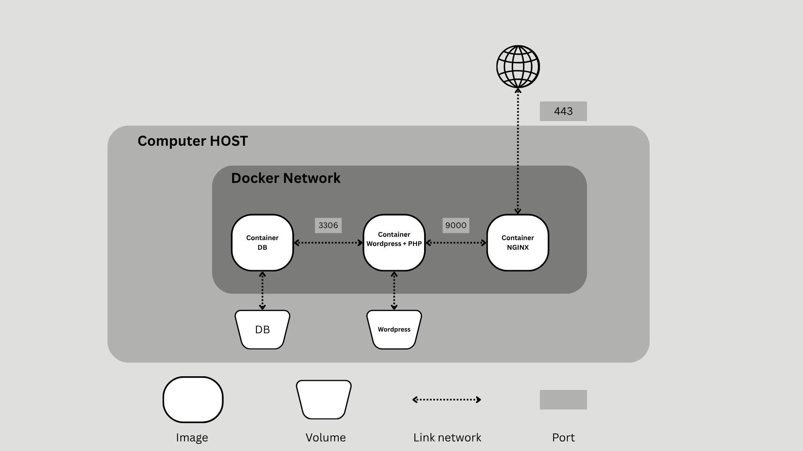

# Inception

## Project Requirement

The objective of this project is to deploy a WordPress website within a sustainable microservices architecture using Debian-based Docker images. Each service must run in its own container and communicate through isolated and secure networks while following containerization best practices.

---

### Configure ".env" file

You can configure ".env" file accourding to underline example:
```
MYSQL_USER=exampledb
MYSQL_PASSWORD=exampledb
MYSQL_HOSTNAME=mariadb
MYSQL_DATABASE=exampledb
DOMAIN_NAME=example.example.com

WP_TITLE=Inception
WP_ADMIN_USER=example
WP_ADMIN_EMAIL=example@example.com
WP_ADMIN_PWD=example

WP_USR=example2
WP_PWD=example2
WP_EMAIL=example2@example.com
```

---

## Technologies Used

* Docker
* Docker Compose
* Nginx
* MariaDB
* WordPress
* PHP-FPM
* TLS/SSL
* Debian
* Bash Scripting

---
<p align="center">
  
</p>

## Project Overview

This infrastructure consists of three main services:

* **Nginx** – Reverse proxy and HTTPS endpoint
* **WordPress** – Application service running on PHP-FPM
* **MariaDB** – Database service

Each service is built from its own custom Debian-based Docker image and runs in an isolated container environment.

---

## Technical Implementation

### MariaDB

A dedicated Debian-based Docker image was created for MariaDB.

During the image build process:

* MariaDB is installed using the Debian package manager.
* A custom initialization script is executed when the container starts.
* The script automatically:

  * Creates the WordPress database.
  * Creates a dedicated database user.
  * Assigns the required privileges.

For security purposes:

* MariaDB is configured to accept connections only from the Docker internal subnet (`172.0.0.0/16`).
* The database service is not exposed to the public network.
* Port `3306` is exposed only for communication between containers within the Docker network.

---

### WordPress

A custom Debian-based image was built for WordPress.

The image includes:

* WordPress
* PHP 8.2-FPM
* WP-CLI

A startup script handles the initial setup process by:

* Connecting to the MariaDB service.
* Automatically generating the required WordPress database tables.
* Configuring the WordPress installation.

The PHP-FPM service listens on port `9000`, which is exposed internally for communication with the Nginx container.

---

### Nginx

Nginx acts as the public entry point of the infrastructure.

The Nginx image includes:

* TLS/SSL configuration
* Reverse proxy configuration
* Custom virtual host configuration

Security measures include:

* Generation of a 4096-bit RSA SSL certificate.
* HTTPS-only traffic handling.
* Routing requests from a custom local domain to the WordPress service through PHP-FPM.

The Nginx container exposes port `443`, which is bound to the host machine's port `443`.

---

## Storage Management

Persistent storage is implemented using Docker volumes.

### WordPress Volume

Stores:

* WordPress core files
* Themes
* Plugins
* User uploads

### MariaDB Volume

Stores:

* Database files
* User data
* WordPress content metadata

This ensures data persistence even if containers are removed or recreated.

---

## Networking

A dedicated Docker bridge network named `wp_network` is used for internal communication.

Benefits of this approach:

* Service isolation
* Secure container-to-container communication
* DNS resolution through container names
* Reduced attack surface by limiting external exposure

Only the Nginx service is accessible from outside the Docker network.

---

## Environment Variables

Sensitive information is stored inside a `.env` file, including:

* Database credentials
* WordPress administrator credentials
* Domain configuration

This prevents confidential information from being hardcoded into source files.

---

## Security Considerations

Several security measures have been implemented:

* Isolated containers for each service
* Private Docker network for internal communication
* MariaDB inaccessible from external networks
* TLS/SSL encryption using a 4096-bit RSA certificate
* Environment variables for sensitive configuration
* Persistent storage through dedicated volumes
* Reverse proxy architecture with Nginx as the only public-facing service
